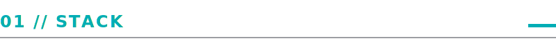
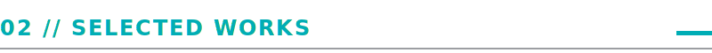
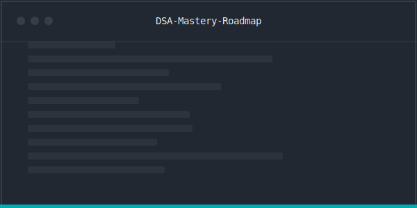
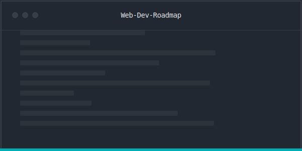
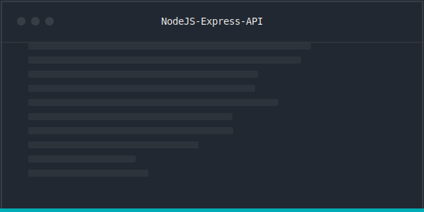
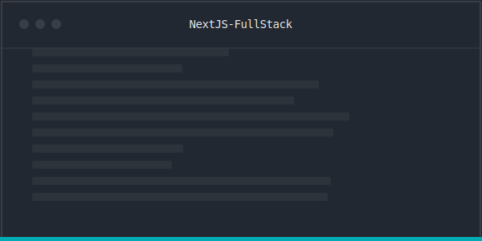
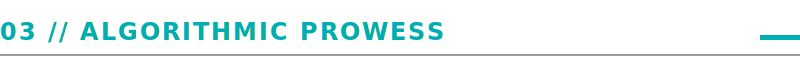

<!-- 
  Design System: Cyber-Swiss
  Palette: #222831 (Bg), #393E46 (Card), #00ADB5 (Accent), #EEEEEE (Text)
  Typography: Geist Mono / System Monospace
  Constraint: Zero Emoji. Pure SVG.
-->

  

  <em style="font-family: 'Segoe UI Mono', monospace; color: #EEEEEE; font-size: 14px; letter-spacing: 1px;">
    Crafting scalable systems with cold precision.
  </em>

 

<!-- NOW Section -->

  
  

 

<!-- STACK -->

  
    
  
  <!-- Languages -->
   &nbsp;
   &nbsp;
   &nbsp;
   &nbsp;
   &nbsp;
  
  <!-- Separator -->
   &nbsp;
  
  <!-- Frontend -->
   &nbsp;
   &nbsp;
   &nbsp;
  
  <!-- Separator -->
   &nbsp;
  
  <!-- Backend/Tools -->
   &nbsp;
   &nbsp;
   &nbsp;
  

 

<!-- FEATURED WORK -->

  
   

<table align="center" border="0" cellpadding="10" cellspacing="0">
  <tr>
    <td width="50%" align="center" valign="top">
      
       
      <b style="color: #00ADB5; font-family: monospace;">DSA Mastery Roadmap</b>
       
      Comprehensive C++ & Python algorithms archive.
       
      
      
    </td>
    <td width="50%" align="center" valign="top">
      
       
      <b style="color: #00ADB5; font-family: monospace;">Modern Web Engineering</b>
       
      Full-stack mastery from HTTP to Serverless.
       
      
      
    </td>
  </tr>
  <tr>
    <td width="50%" align="center" valign="top">
      
       
      <b style="color: #00ADB5; font-family: monospace;">Production API Core</b>
       
      Scalable microservices architecture base.
       
      
      
    </td>
    <td width="50%" align="center" valign="top">
      
       
      <b style="color: #00ADB5; font-family: monospace;">Next.js Enterprise</b>
       
      High-performance SSR/ISR framework.
       
      
      
    </td>
  </tr>
</table>

 

<!-- PROBLEM SOLVING -->

  
   

  

 

<!-- METRICS -->

  
   

  
  

 

<!-- FOOTER -->

  
    
  
  &nbsp;&nbsp;
  
  &nbsp;&nbsp;
  

 

<!-- Noise Overlay (Simulated via footer image to not block clicks, or just ignored if complex) -->
