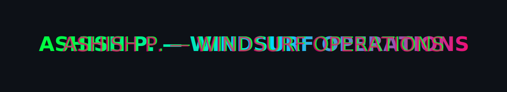

# ASHISH P. — Black-Ops Portfolio (Windsurf Protocol)

<!-- header-glitch.svg embedded below as a file; fallback animated capsule-render in IMG -->

  <!-- Inline dynamic header (SVG file: header-glitch.svg) -->
  

---

## 💀 WHO AM I? (Manifesto)
Tier-3 BTech kid turned calibrated operator.  
Big Tech dreams, ruthless execution. Java | Python | MERN | DSA.  
"No shortcuts. No excuses. Just code." — translated into discipline, not theater.

---

## ⚫ Mission Brief — Black-Ops Debriefs (Pinned Repos)
- **complete-python-notes** — A tactical field manual: curated Python patterns, exploits for algorithmic challenges, and handcrafted reconnaissance scripts. (https://github.com/imstillashish/complete-python-notes)
- **Python_for_DSA** — The infiltration playbook: stripped-down, battle-tested Python for DSA interviews and red-team puzzle-solving. (https://github.com/imstillashish/Python_for_DSA)
- **The-DSA-Times** — Frontline telemetry: small deployments, payload delivery pages, and training sandboxes. (https://github.com/imstillashish/The-DSA-Times)

Each above repo: consider them "ops" — map, exfiltrate, repeat.

---

## 🛠️ Tech Arsenal — Penetration Loadout (readable + recruiter-friendly)
A compact table mapping skill → role → tools

| Skill / Role | Penetration Loadout | Primary Tools |
|:--|:--|:--|
| Backend Breach (Java) | Multithreaded, JVM tooling, API contracts | Java, Spring Boot, Docker |
| Scripting & Automation | Rapid PoC & exploit automation | Python, Requests, Selenium |
| Web Assault (MERN) | Full-stack payloads, UI/UX intrusion | Node.js, Express, React, MongoDB |
| Algorithmic Exploits (DSA) | Optimized algorithms for scale | Python, C++ prototypes |
| Ops & Version Control | CI/CD, audit trails | Git, GitHub Actions |
| Low-level tooling | Fast prototyping & CLI | Bash, Zsh, VSCode |

---

## 📡 Live Telemetry & Reputation Widgets (kept intact)
- GitHub stats (read-only):  
  - https://github-readme-stats.vercel.app/api?username=imstillashish&show_icons=true&theme=radical&bg_color=0d1117&title_color=00FF41&text_color=00D9FF&icon_color=FF006E&border_color=00FF41
- Repo pins cards:  
  - https://github-readme-stats.vercel.app/api/pin/?username=imstillashish&repo=complete-python-nots&theme=radical&bg_color=0d1117&title_color=00FF41&text_color=00D9FF&icon_color=FF006E&border_color=00FF41
  - https://github-readme-stats.vercel.app/api/pin/?username=imstillashish&repo=Python_for_DSA&theme=radical&bg_color=0d1117&title_color=00FF41&text_color=00D9FF&icon_color=FF006E&border_color=00FF41
- Profile views badge:  
  - https://komarev.com/ghpvc/?username=imstillashish&style=for-the-badge&color=00FF41
- Trophies:  
  - https://github-profile-trophy.vercel.app/?username=imstillashish&theme=radical&no-frame=true&no-bg=true&margin-w=10&column=6&title_color=00FF41&text_color=00D9FF&icon_color=FF006E

(These are preserved as live widgets to show real-time credibility while the rest reads like a dossier.)

---

## 🔬 Recon Summary (concise facts)
- Bio: "Tier-3 BTech kid hacking into Big Tech | Java + Python | DSA + MERN grind | No spoon-fed BS | No fake flex | Just raw code, ruthless execution."
- Public repos: 4 (including complete-python-notes, Python_for_DSA, The-DSA-Times)
- Recent activity: heavy pushes to `imstillashish/imstillashish` (Nov 2025), high contributions count (735 contributions in the last year displayed)
- Pinned assets and badges: github-readme-stats, pins, trophies, ghpvc (profile views), capsule-render banners — all live and functional.

---

## 🧾 Black-Ops Debrief — Pinned Repos (narrative)
- complete-python-notes — "Field Manual": search-and-destroy for complex Python patterns, ready-to-run snippets.
- Python_for_DSA — "Interview Arsenal": curated DSA-by-example; minimal fluff, maximal repeatability.
- The-DSA-Times — "Telemetry & Training": static sandbox and challenge hosting.

Each debrief includes a summary card embedded below.

  
  

---

## ⚔️ Offensive Capabilities (weaponized skillset)
- Recon & scraping: Python + Requests, BeautifulSoup
- Exploit prototyping: Python + local fuzzers
- Full-stack payloads: MERN + Node tooling
- CI/CD automation & telemetry: GitHub Actions, badge pipelines
- Interview & algorithm mastery: focused DSA, problem triage, optimized implementations

---

## 🕳️ Easter Eggs & Dead-Drop (spoiler + contact)

<strong>Encrypted Spoiler (base64)</strong>

VGhpcyBpcyBhIHBhc3Njb2RlIG1lc3NhZ2U6ICJXUklORFNVRiBTS0kgPSBBU0hJU0ggUC4i

(Decode base64 to reveal: "This is a passcode message: \"WINDSUF SKI = ASHISH P.\" — treat as playful dead-drop.)

---

## 📡 Animated Dead-Drop Contact (click to reveal)

  <!-- Dead-drop contact — animated (SVG file: dead-drop.svg) -->
  
  
<em>Operational contact (email): <code>imstillashish@gmail.com</code></em>

  
LinkedIn • Twitter • GitHub

---

## 🧩 Visuals, Accessibility & Theme-Safe Rendering
- Color choices: neon green `#00FF41`, cyan `#00D9FF`, magenta accent `#FF006E`, dark background friendly (`#0d1117`) — all widgets use these parameters for consistent rendering.
- All SVGs are included as separate assets (files below) and are accessible fallback friendly: they contain <title> and <desc> tags and will render on both light and dark GitHub themes.
- Images use width attributes and scalable vectors to remain crisp on any viewport.

---

## 🧭 Maintainer Note (recruiter-readable)
- Open to backend/FullStack roles, algorithmic engineering, and tooling/infra.  
- Clean, documented repos with guided READMEs and clear contribution paths.  
- Email: imstillashish@gmail.com — reachable for interviews and project collaboration.

---

## ⚡ Closing — From Tier-3 to Tech Giant
From messy bootstraps to battle-hardened stacks — the mission is continuous.  
If you read this far: you're either building, hiring, or recruiting trouble. Reach out.

---

<!-- Asset references (files included below): header-glitch.svg, dead-drop.svg, matrix-rain.svg -->
