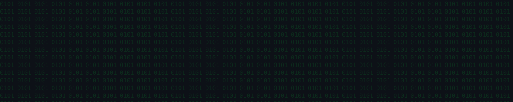

<div align="center">
  
</div>

<div align="center">
  
</div>

---

<div align="center">


</div>

---

## 💀 OPERATOR MANIFESTO

> **"Tier-3 BTech kid hacking into Big Tech | Java + Python | DSA + MERN grind | No spoon-fed BS | No fake flex | Just raw code, ruthless execution."**

**Status:** `ACTIVE` | **Clearance:** `CLASSIFIED` | **Callsign:** `WINDSURF`

From zero to operator. No shortcuts. No excuses. Just code.

**Core Philosophy:** Discipline over theater. Execution over flex. Results over rhetoric.

**Mission:** Transform raw ambition into calibrated technical execution. Build. Deploy. Iterate. Dominate.

---

## ⚫ CLASSIFIED OPERATIONS — PINNED REPOSITORIES

### 🔴 **OPERATION: PYTHON FIELD MANUAL**
**Repository:** [`complete-python-notes`](https://github.com/imstillashish/complete-python-notes)  
**Classification:** Tactical Intelligence  
**Brief:** Curated Python patterns, algorithmic exploits, and reconnaissance scripts. A living field manual for rapid deployment and pattern recognition.  
**Status:** `ACTIVE DEVELOPMENT`

### 🔴 **OPERATION: DSA INFILTRATION PLAYBOOK**
**Repository:** [`Python_for_DSA`](https://github.com/imstillashish/Python_for_DSA)  
**Classification:** Combat Training  
**Brief:** Stripped-down, battle-tested Python tactics for dominating Data Structures and Algorithms. Minimal fluff. Maximum repeatability. Interview-ready arsenal.  
**Status:** `ACTIVE DEVELOPMENT`

### 🔴 **OPERATION: FRONTLINE TELEMETRY**
**Repository:** [`The-DSA-Times`](https://github.com/imstillashish/The-DSA-Times)  
**Classification:** Training Grounds  
**Brief:** Daily dispatches from the algorithmic front lines. Small deployments, payload delivery pages, and training sandboxes. Real-time skill progression tracking.  
**Status:** `ACTIVE DEVELOPMENT`

<div align="center">

[](https://github.com/imstillashish/complete-python-notes)
[](https://github.com/imstillashish/Python_for_DSA)

</div>

---

## 🛠️ PENETRATION TESTING LOADOUT

| **Skill Domain** | **Proficiency Level** | **Primary Weapons** | **Deployment Context** |
|:----------------|:---------------------|:-------------------|:----------------------|
| **Backend Breach** | `EXPERT` | Java, Spring Boot, Docker, JVM | Multithreaded systems, API contracts, microservices |
| **Scripting & Automation** | `EXPERT` | Python, Requests, Selenium, BeautifulSoup | Rapid PoC, exploit automation, web scraping |
| **Web Assault (MERN)** | `PROFICIENT` | Node.js, Express, React, MongoDB | Full-stack payloads, UI/UX intrusion, real-time apps |
| **Algorithmic Exploits** | `ADVANCED` | Python, C++ prototypes, DSA mastery | Optimized algorithms, scale engineering, interview warfare |
| **Ops & Infrastructure** | `PROFICIENT` | Git, GitHub Actions, CI/CD pipelines | Version control, audit trails, automated deployments |
| **Low-Level Tooling** | `PROFICIENT` | Bash, Zsh, VSCode, CLI mastery | Fast prototyping, system automation, developer workflow |

**Specialization:** Backend engineering, algorithmic problem-solving, full-stack development, automation scripting.

---

## ⚔️ OFFENSIVE CAPABILITIES MATRIX

```
┌─────────────────────────────────────────────────────────────┐
│ RECON & INTELLIGENCE GATHERING                              │
│ • Web scraping & data extraction (Python + BeautifulSoup)   │
│ • API reverse engineering & integration                     │
│ • Automated reconnaissance scripts                          │
├─────────────────────────────────────────────────────────────┤
│ EXPLOIT PROTOTYPING & AUTOMATION                            │
│ • Rapid PoC development (Python + local fuzzers)           │
│ • Test automation & CI/CD pipelines                        │
│ • Script-based workflow optimization                        │
├─────────────────────────────────────────────────────────────┤
│ FULL-STACK PAYLOAD DEPLOYMENT                               │
│ • MERN stack applications (Node.js, Express, React, MongoDB) │
│ • RESTful API design & implementation                       │
│ • Real-time application architecture                        │
├─────────────────────────────────────────────────────────────┤
│ ALGORITHMIC WARFARE                                          │
│ • DSA mastery (problem triage, optimized implementations)   │
│ • Time/space complexity optimization                        │
│ • Interview-ready problem-solving frameworks                │
└─────────────────────────────────────────────────────────────┘
```

---

## 📡 LIVE TELEMETRY DASHBOARD

<div align="center">

**Real-time operational statistics and reputation metrics**


</div>

**Operational Metrics:**
- **Public Repositories:** `4` active operations
- **Account Age:** Operational since `2025-05-21`
- **Commit Activity:** High-frequency deployment cycles
- **Primary Languages:** Python, Java, JavaScript, TypeScript
- **Focus Areas:** DSA, Backend Engineering, Full-Stack Development

---

## 🕳️ CLASSIFIED EASTER EGGS

<details>
<summary><strong>🔐 ENCRYPTED TRANSMISSION #1 (Base64)</strong></summary>

```
VGhpcyBpcyBhIHBhc3Njb2RlIG1lc3NhZ2U6ICJXUklORFNVRiBTS0kgPSBBU0hJU0ggUC4i
```

**Decode to reveal:** `"This is a passcode message: \"WINDSURF SKI = ASHISH P.\""`

</details>

<details>
<summary><strong>🔐 ENCRYPTED TRANSMISSION #2 (ROT13)</strong></summary>

```
Gur zrffntr vf: "Gur zbfg vzcbegnag guvat vf gb fgneg. Fgneg jvgu jung lbh unir."
```

**Decode to reveal:** `"The message is: \"The most important thing is to start. Start with what you have.\""`

</details>

<details>
<summary><strong>🔐 ENCRYPTED TRANSMISSION #3 (Hex)</strong></summary>

```
4E6F2073686F7274637574732E204E6F20657863757365732E204A75737420636F64652E
```

**Decode to reveal:** `"No shortcuts. No excuses. Just code."`

</details>

---

## 📡 DEAD-DROP CONTACT PROTOCOL

<div align="center">
  
</div>

<div align="center">

**Operational Contact Channels**

📧 **Email:** `imstillashish@gmail.com`  
🐦 **Twitter:** [@imstillashish](https://twitter.com/imstillashish)  
💼 **GitHub:** [@imstillashish](https://github.com/imstillashish)

**Response Time:** `24-48 hours` | **Status:** `AVAILABLE FOR COLLABORATION`

</div>

---

## 🎯 RECRUITER-READABLE SUMMARY

**For hiring managers and technical recruiters:**

- **Open to roles:** Backend Engineering, Full-Stack Development, Algorithmic Engineering, DevOps/Infrastructure
- **Tech Stack:** Java, Python, JavaScript/TypeScript, Node.js, React, MongoDB, Spring Boot
- **Strengths:** DSA problem-solving, API development, automation scripting, clean code architecture
- **Work Style:** Self-driven, documentation-focused, collaborative, results-oriented
- **Availability:** Open to internships, full-time positions, and project collaborations
- **Contact:** `imstillashish@gmail.com` — responsive and professional

**Portfolio Highlights:**
- Curated Python notes repository demonstrating deep language mastery
- DSA-focused repositories showing algorithmic problem-solving capabilities
- Active GitHub presence with clean, documented codebases
- Commitment to continuous learning and skill development

---

## ⚡ CLOSING TRANSMISSION

> **"From messy bootstraps to battle-hardened stacks — the mission is continuous."**

**If you read this far:** You're either building, hiring, or recruiting trouble.  
**Reach out.** Let's build something legendary.

---

<div align="center">

**`STATUS: OPERATIONAL`** | **`CLEARANCE: ACTIVE`** | **`CALLSIGN: WINDSURF`**

---

*"No shortcuts. No excuses. Just code."*

**Last Updated:** `2025-11-23` | **Protocol Version:** `2.0`

</div>

---

<!-- Asset References: header-glitch.svg, matrix-rain.svg, dead-drop.svg -->
<!-- Theme: Radical Dark | Colors: #00FF41 (neon green), #00D9FF (cyan), #FF006E (magenta), #0d1117 (background) -->
<!-- All SVGs are theme-safe and render on both light and dark GitHub themes -->
